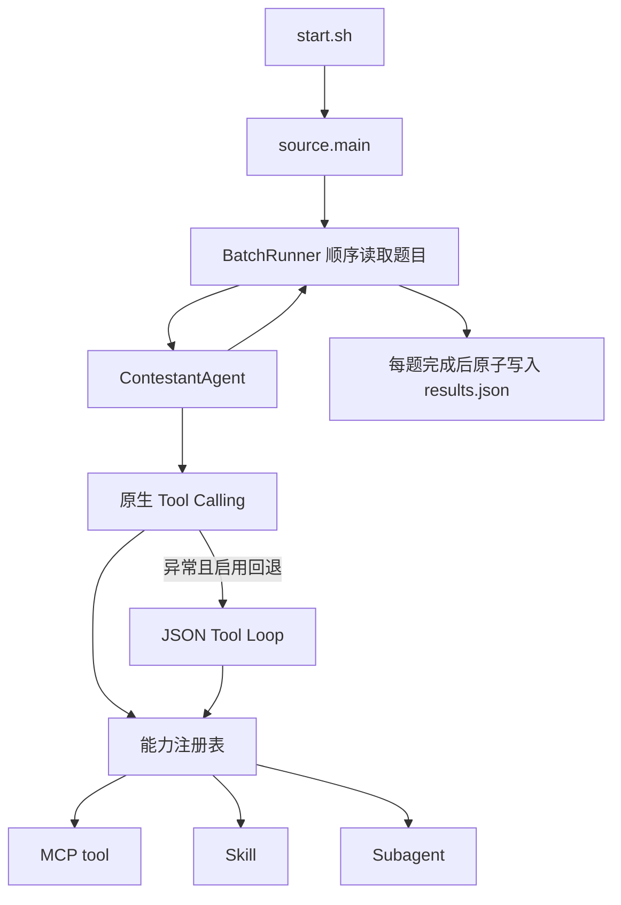
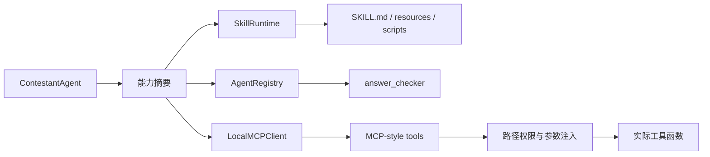

# Agent 大赛参赛与实习复盘记录

记录时间：2026 年 6 月 15 日  
项目仓库：`agent-contest-python-demo`  
主要语言：Python  
我的工作范围：Agent 架构调整、工具开发、运行时加固、测试诊断和比赛提交

## 一、参赛背景

本次比赛要求参赛程序在无人交互的环境中独立完成题目。平台通过
`start.sh` 传入题目 JSON 路径、结果 JSON 路径和 `package_id`，程序需要读取题面与附件，
调用比赛模型、工具、Skill 或子 Agent，最后把每道题的答案写入 `results.json`。

题目并不是普通问答。公开案例包含自然语言日期计算、顺序接口测试、压缩包敏感信息扫描、
Java 源码修复、多表采购审计，以及 SQLite、Wiki 和人物设定混合检索等任务。评分只读取
`answer` 字段，很多题采用精确匹配，因此多一个解释、少一个分隔符，或者引用了错误版本的资料，
都会直接丢分。

平台对单次完整运行设置了 1 小时上限。比赛方后来反馈，我们有一次 0 分提交的直接原因是总执行
时间超限。根据我保留的提交记录，官方原始 Demo 曾得到约 8 分，后续增强版本一度低于 3 分，
最后两次提交显示为 0 分。最后两次没有拿到完整判题日志，因此不能把 0 分全部归因于某一个代码
缺陷，但超时、答案精确度和环境差异都是实际存在的风险。

## 二、官方 Demo 的基线架构

这里的“官方 Demo”特指 `D:\Research_vault\raw\writing\comoetition-tests` 仓库中的
`345200f Initial public demo release`，不是我们后来修改的 `agent-contest-python-demo`。

官方 Demo 是参赛框架模板。它提供输入输出协议、模型调用循环，以及 MCP Tool、Skill 和
Sub-agent 的扩展接口，但没有替参赛者实现真实题型所需的业务能力。



`ContestantAgent` 会把题面、附件路径和自动发现的能力摘要交给模型。模型默认使用原生 Tool
Calling；如果该流程抛出异常，程序可以改用提示词约定的 JSON 工具协议。官方提交附带的 `.env`
配置为最多 10 轮、单次请求超时 120 秒、流式开启、最大输出 3,200 tokens。代码在环境变量缺失时
才回退到 6 轮、60 秒和非流式。

官方 Demo 实际提供的能力如下：

| 类型 | 组件 | 实际作用 |
|---|---|---|
| 通用工具 | `text_read_file` | 读取题目声明的单个 UTF-8 文本，最多返回 64,000 字符 |
| Skill 基础设施 | `skill_load`、`skill_read_resource`、`skill_run` | 展示 Skill 的发现、加载、资源读取和脚本执行流程 |
| Sub-agent 基础设施 | `agent_delegate` | 展示如何调用自动发现的子 Agent |
| Mock MCP | `mock_order_lookup`、`mock_policy_check` | 返回固定 Mock JSON，不执行真实查询或规则判断 |
| Mock Skill | `mock_summary_skill` | 返回固定的 `mock-summary-skill-ok` |
| Mock Sub-agent | `mock_review_agent` | 返回固定的 Demo 审查结果 |

因此，官方 Demo 中只有 `text_read_file` 能直接帮助解题。Mock MCP、Mock Skill 和 Mock
Sub-agent 的目的都是演示扩展点，不具备真实比赛能力。`requirements.txt` 为空，主体只依赖
Python 标准库，这让部署比较稳定，但也说明文档、表格、图像、压缩包和数据库等能力需要参赛者
自行补充。

`BatchRunner` 顺序处理题目，并在每题结束后通过临时文件和 `os.replace` 原子更新
`results.json`。某题抛出异常时写入空答案，前面已经完成的结果仍然保留。这部分实现与赛方协议
吻合，也是官方 Demo 能得到基础分的重要原因。

## 三、官方 Demo 面对真实题目的能力缺口

### 1. 提供的是扩展框架，不是完整解题 Agent

官方 Demo 展示了 Tool、Skill 和 Sub-agent 三种扩展形式，但附带实现都是 Mock。模型看到的能力
列表看起来完整，实际却无法用 `mock_order_lookup` 查询订单，无法用 `mock_policy_check` 检查
规则，也不能让 `mock_review_agent` 做有效复核。

如果不增加参赛者自己的组件，Agent 的解题方式基本是直接依靠模型知识，或者用
`text_read_file` 读取少量文本后回答。这可以处理简单问答，却覆盖不了公开案例中的接口执行、
Java 修复、多表审计和多源证据关联。

官方系统提示还把任务称为“skill 蒸馏攻防 Agent 大赛”。实际比赛要求 Agent 在无人交互环境中
独立完成多类任务，并不是让模型输出或蒸馏解题思路。这个表述不会直接导致程序失败，但会让主
Agent 误判比赛重点。

### 2. 附件发现和文件类型支持不足

`text_read_file` 只能读取一个已知路径的 UTF-8 文本。官方 Demo 没有目录遍历工具，因此题目如果
只声明一个目录，模型无法先列出其中有哪些文件。它也不能直接处理 DOCX、XLSX、SQLite、图片、
ZIP/TAR 或二进制附件。

它对比赛放在项目外部的 `question_path` 和 `result_path` 本身是兼容的：两条路径都会被解析为
绝对路径。真正的缺口是附件工具能力，而不是要求输入必须位于项目目录。我们后续遇到的
`File is not declared in the question`，来自增强版路径权限逻辑与具体题目路径组合，不能写成
官方 Demo 不支持外部输入。

### 3. 缺少真实题型所需的确定性工具

公开案例需要的不只是读取材料，还要执行可验证的操作：

- 日期题需要批量解析和统一格式化；
- 接口题需要按顺序发送请求、保存 token、提取变量并执行断言；
- 压缩包题需要安全解压、递归遍历和内容检查；
- Java 题需要编译、运行和多用例验证；
- 采购审计需要同时关联 CSV、规则和多份审批证据；
- 检索题需要查询 DOCX、SQLite、Wiki 或聊天记录，并尽量保留原文。

官方 Demo 没有这些能力，也没有通用代码执行器。完全交给模型逐步阅读和心算，会增加调用次数，
并让结果难以复现。

### 4. 工具循环的异常回退可能重复执行整题

原生 Tool Calling 流程外层使用了宽泛的 `except Exception`。只要该流程出现任何异常，且
`AGENT_DEMO_JSON_TOOL_FALLBACK` 开启，就会从头进入 JSON Tool Loop。

网络中断、模型超时或工具内部错误不等于网关不支持原生工具。宽泛回退可能重复已经完成的模型
调用和工具操作。对于有状态接口题，这还可能重复写请求。增强版后来把回退范围缩小到明确的
Tool Calling 不兼容错误。

JSON Tool Loop 会把整段工具结果直接截到 16,000 字符。截断发生在 JSON 序列化之后，可能形成
不完整 JSON；原生循环则把每次工具输出截到 12,000 字符。长文档和大批量结果容易因此丢失证据。

### 5. 缺少单题和整批运行预算

官方 Demo 只有单次模型请求超时和最大循环轮数，没有单题硬超时、整批剩余时间预算或超时前兜底。
提交包配置为单次请求 120 秒、最多 10 轮，但一轮可以包含多个工具调用，最后还可能增加一次强制
回答请求。单题理论耗时仍可能达到十几分钟。

它会顺序执行全部题目。前面的题如果出现慢请求、长工具或回退重跑，后面的题就没有执行机会。
比赛方后来确认我们的增强版曾因总执行时间超过 1 小时得到 0 分。这不是官方 Demo 的实测结果，
但官方框架本身确实没有阻止这类风险。

官方 Demo 也没有在启动时预分配全部题目的空结果。如果进程在某题执行期间被平台强制终止，
`results.json` 只包含此前已经完成的题目，尚未运行的题目 ID 不会出现在文件中。

### 6. 输出清理和运行诊断较弱

官方 Demo 会删除完整的 `<think>...</think>` 内容，但不会检查 Markdown 代码块、JSON 合法性、
分隔符、排序或题目要求的精确输出结构。模型返回非空文本不代表答案能被评分器正确匹配。

运行日志只有“开始某题”和异常文本，没有单题耗时、累计耗时、LLM 调用次数、工具调用次数、
答案长度和结果文件状态。程序发生超时或空答案时，很难从平台日志判断问题停在哪一步。

### 7. 官方 Demo 为什么仍然能得到分数

官方 Demo 的优势不是能力全面，而是链路短。它没有 Checker、数据读取子 Agent、Dashboard 或
大量题型专用工具，模型往返次数通常更少。`start.sh` 直接启动 Python，默认不下载依赖；结果又在
每题结束后立即写入。这些特点降低了部署失败和整批超时的概率。

它曾得到约 8 分，说明比赛题中至少有一部分可以由模型直接回答或通过单文本读取完成，也说明
先稳定地产生可评分结果比堆叠大量能力更重要。但这个分数不能证明 Mock Skill、Mock Sub-agent
或 Mock MCP 对真实题目有效。

## 四、增强版本开发中暴露的问题与改进

以下问题来自我们在 `agent-contest-python-demo` 上的开发过程，不属于官方 Demo 原始实现。

### 1. 输入、输出和运行时加固

增强版曾因路径权限组合出现 `File is not declared in the question`。我重新梳理了附件访问
边界，使题目声明的文件、目录及其子文件可以在安全范围内读取。运行开始时先为全部题目预分配
空答案，并继续保持每题完成后立即写入结果，减少程序中途终止造成的答案丢失。

日志增加了题目 ID、状态、答案是否存在、答案长度、完整错误、单题耗时、累计耗时、LLM 调用数、
工具调用数、当前写入结果数，以及 `results.json` 的路径和文件大小。

### 2. Trace 和本地 Dashboard

为了定位平台只显示“0 分”但不给完整内部过程的问题，我增加了结构化 Trace 和可选 Dashboard。
Dashboard 可以查看每次 LLM 调用、工具调用、耗时和错误，同时避免自动刷新把正在阅读的页面滚回
顶部。Dashboard 默认关闭，不参与比赛提交入口，避免额外 I/O 影响正式运行。

### 3. 模型调用参数调整

我测试过流式与非流式、开启和关闭思考、不同迭代次数以及不同超时设置。最终保留了：

- 流式响应；
- 关闭模型思考；
- 单次 LLM 请求超时 120 秒；
- 主 Agent 最大 10 轮工具循环；
- 单题硬超时 600 秒；
- 工具历史输出上限 65,536 字符。

参数调整的目标不是追求模型多想，而是让每道题在有限时间内形成可评分答案。

增强过程中，Prompt 也曾加入过多 Few-shot、工作日规则、数据库示例和复核流程。它们会在每轮
调用中重复占用上下文，还容易诱导模型机械套用。后续版本删除了大部分 Few-shot，只保留无人值守、
按需调用工具、优先批量处理和严格输出格式等核心约束。

### 4. 批量和确定性工具

我补充或增强了以下能力：

- `date_compute`：支持批量日期表达式，避免一条日期调用一次模型；
- `image_read`：支持多图一次读取，并把 Base64 图像直接交给主 Agent；
- `document_search`：检索 Markdown、Word 等规范文档；
- `archive_inspect`：安全解压 ZIP/TAR，递归列出文件并返回文本预览；
- `dataset_bundle_read`：一次读取目录内的 CSV、JSON、文本、DOCX 和 XLSX，生成统一 JSON bundle；
- `api_test_execute`：按顺序执行接口测试计划，处理 token、断言和失败继续；
- `evidence_chain_analyze`：汇总前端、后端、HAR、截图等多源故障证据；
- `code_execute`：增强 Java 类名识别、UTF-8 编译、参数传递和多用例运行。

这些工具的共同思路是：能由程序确定完成的工作，不要拆成多轮模型对话。

### 5. Skill 和子 Agent 的取舍

我尝试过 Data Reader、文档搜索 Skill、华为编程规范 Skill 和 Java 个税 Skill。实践中，Skill 并非
越多越好。过重的 Skill 会增加发现、加载和执行成本，也可能诱导模型机械套用。

最终 Java 个税能力采用“指导型 `SKILL.md` + 可参考脚本”的方式：给 Agent 代码修复思路和示例，
但不硬编码官方题目的答案。Data Reader 和文档搜索子 Agent 被轻量工具替代，主 Agent 直接负责
答案正确性。

增强版还一度让 Answer Checker 判断答案内容、调用工具并多轮修正。这样会重复主 Agent 的工作，
也可能在证据不足时改坏原答案。最终 Checker 被缩减为单次格式后检查，只处理空答案、Markdown、
`<think>`、JSON 合法性、分隔符和输出结构；Checker 失败时保留主 Agent 原答案。

### 6. 超时前兜底

当前版本在 600 秒单题硬超时前预留 90 秒。达到软截止后，不再接受新的模型分析或工具调用，
而是要求主模型根据已经获得的证据输出最可能的最终答案，并跳过 Checker。

我还把采购审计题的软截止临时提前到 200 秒做过实验。该题在 203.6 秒输出答案，LLM 调用从 12 次
减少到 5 次、工具调用从 11 次减少到 4 次，答案与 315 秒完整运行相同。这说明后半段耗时主要来自
重复复查。

不过，兜底机制仍有边界：同步阻塞工具不能被 `asyncio.wait_for` 立即中断。如果某个
`code_execute` 一直运行到硬超时之后，程序仍可能来不及生成兜底答案。

## 五、Skill、Sub-agent 与 MCP Tool 的设计

### 1. 能力发现与调用架构

当前方案没有把所有逻辑都写进主 Agent。程序启动时会扫描 `source/solution/skills`、
`source/solution/agents` 和 `source/solution/mcp`，再把能力摘要交给模型：



每个工具都带有名称、描述、JSON Schema、类型和风险等级。`LocalMCPClient` 在真正执行前处理
文件路径白名单、每题临时目录、`package_id` 和接口鉴权配置。这样主 Agent 只负责选择能力，
权限控制和环境参数由运行时统一完成。

### 2. Skill 运行机制

Skill 是“说明文档 + 可选资源 + 可选脚本”的能力包。模型先通过 `skill_load` 读取
`SKILL.md`，需要示例时使用 `skill_read_resource`，只有存在可执行入口时才能调用
`skill_run`。脚本通过标准输入接收 JSON，并在独立子进程中运行，具有单独超时。

当前运行时实际发现 3 个 Skill：

#### `spreadsheet`（目录名和配置名为 `data_analyzer`）

设计目标是处理 CSV、JSON 和 Excel，支持汇总、聚合、筛选和行数统计。它包含一个 60 秒超时的
Python 入口，优先使用 pandas 或 openpyxl，也能用标准库读取 CSV 和 JSON。

输入主要包括：

- `task`：`summarize`、`aggregate`、`filter` 或 `count`；
- `data_path`：数据文件路径；
- `columns`、`group_by`、`operation`：分析字段和聚合方式；
- `output_format`：输出格式。

这个 Skill 的问题是元数据不一致：文件夹和 `skill.json` 使用 `data_analyzer`，但
`SKILL.md` frontmatter 的名称是 `spreadsheet`。运行时优先采用 frontmatter，所以主 Agent
实际看到的是 `spreadsheet`。此外，`SKILL.md` 来自通用电子表格工作流，包含创建、格式化和渲染
说明，而比赛脚本只实现分析功能，两者职责并不完全一致。这会增加模型理解成本，应在正式方案中
统一名称并缩小说明范围。

#### `java_tax_solver`

这是指导型 Skill，没有可直接执行的 `skill_run` 入口。它用于识别 Java 个税计算器题，说明常见
源码缺陷、Base64 参数解码、税率区间计算、Java 版本读取和输出格式。

Skill 内保留 `scripts/tax_repair_example.py` 作为参考资源。主 Agent 可以读取其中的
`extract_tax_parameters`、`calculate_tax` 和 `build_answer` 模式，但仍需读取当前题目的 Java
源码并动态提取税率、起征点和隐藏工资，不能直接运行固定答案脚本。

我选择指导型设计，是为了在“完全通用”和“官方题硬编码”之间取平衡。它提高了相似 Java 修复题
的稳定性，但如果隐藏题不再是个税计算器，这个 Skill 就不应被加载。

#### `mock_summary_skill`

这是官方 Demo 生命周期示例。输入一个 `text` 字符串，脚本固定返回
`mock-summary-skill-ok` 和输入预览。它用于验证：

```text
skill_load -> skill_run -> 读取 JSON 结果
```

该 Skill 对正式解题没有贡献。保留它可以做框架冒烟测试，但也会增加模型可见能力数量。正式提交
更理想的做法是确认平台不依赖 Mock 后将其移除。

### 3. Sub-agent 设计

当前只保留一个 Sub-agent：`answer_checker`。

#### `answer_checker`

它是最终答案的格式后检查器，不负责重新解题。主 Agent 把候选答案作为 `task` 传入，
运行时同时提供题目描述。Checker 的脚本先构造严格提示，再调用同一个比赛模型，且
`tools_enabled=false`，没有文件读取和工具权限。

它只检查：

- 空答案；
- Markdown 代码块和 `Final Answer` 等包装；
- `<think>` 标签；
- JSON 引号、括号、转义和合法性；
- 题目明确要求的分隔符、排序和输出结构。

它返回：

```json
{
  "overall_valid": true,
  "cleaned_answer": "清理后的答案",
  "corrected_answer": "仅格式修复后的答案",
  "format_issues": [],
  "summary": "检查摘要"
}
```

主 Agent 只运行一次 Checker。Checker 失败、返回空内容或试图改变数字、日期、ID、事实和列表
成员时，保留主 Agent 原答案。

早期方案还设计过 `data_reader` 子 Agent，让它先探查大文件、再执行精确查询。实际测试发现它会
重复唤醒模型，并且容易把证据摘要与最终判断混在一起。因此后来删除 `data_reader`，用
`dataset_bundle_read`、`csv_read` 和 `sql_query` 等确定性工具替代。

### 4. MCP Tool 的统一设计

运行时会把 MCP、Skill 基础入口和 Sub-agent 调度入口统一转换成 OpenAI Tool Schema。下表按
主 Agent 实际看到的 22 个调用入口整理。`low` 表示只读或纯计算，`medium` 涉及文件、网络、
解压或子进程，`high` 表示代码执行或可能改变外部服务状态。

| 工具 | 类型 | 设计用途 | 主要输入或批量方式 | 风险与限制 |
|---|---|---|---|---|
| `text_read_file` | skill | 读取题目声明的 UTF-8 文本 | `path`、`max_chars` | medium；白名单限制，长文本会截断 |
| `file_list` | skill | 递归列出声明目录中的文件和大小 | `path`、`max_entries` | low；默认最多 200 项，不读取内容 |
| `document_search` | mcp | 检索 DOCX、Markdown、TXT 和 LOG | `paths`、`query`、`limit` | low；关键词打分不能代替语义判断 |
| `image_read` | mcp | 把单图或多图编码后交给主模型理解 | `path` 或批量 `items` | low；图片过多会增加上下文和推理时间 |
| `csv_read` | mcp | 解析一个或多个 CSV | `path` 或批量 `items`，可指定编码和分隔符 | low；只解析，不完成业务判断 |
| `csv_aggregate` | mcp | 执行求和、平均、计数、极值和分组 | `data`、`operation`、`column`、`group_by` | low；数据需先进入上下文，不适合超大表 |
| `date_compute` | mcp | 计算自然语言日期和日期列表 | `expression`、`base_date` 或批量 `items` | low；节假日和歧义表达仍需额外规则 |
| `sql_query` | mcp | 批量查询一个或多个 SQLite 数据库 | `db_path`、`query` 或批量 `items` | medium；只允许 `SELECT`，限制返回行数 |
| `dataset_bundle_read` | mcp | 将目录内 CSV、JSON、文本、DOCX、XLSX 汇总成统一 JSON | `path`、文件类型、行数和字符上限 | low；负责归一化，跨文件语义仍需模型或代码处理 |
| `archive_inspect` | mcp | 检查 ZIP/TAR 和嵌套压缩包，返回清单与文本预览 | `archive_path`、`recursive`、`max_files` | medium；拒绝路径穿越、链接和设备文件，不直接给出业务答案 |
| `zip_extract` | mcp | 解压 ZIP 到每题临时目录 | `zip_path`、`output_dir` | medium；不能处理 TAR 和嵌套包，主要用于兼容旧调用 |
| `tar_extract` | mcp | 解压 TAR、TAR.GZ、TGZ、TAR.BZ2 | `tar_path`、`output_dir` | medium；不提供内容预览，主要用于兼容旧调用 |
| `code_execute` | mcp | 执行 Python、Java 或 Node.js，并返回输出和退出码 | `language`、`code`、`args`、`stdin_cases`、`timeout` | high；同步子进程可能越过软截止，模型也可能反复修补脚本 |
| `http_request` | mcp | 发送通用 HTTP 请求 | `url`、`method`、Header、Body、超时 | medium；单次请求不管理跨步骤状态 |
| `api_test_execute` | mcp | 顺序执行接口测试计划，保存 token、提取变量并断言 | 结构化 `plan` | high；可能调用写接口，测试步骤和依赖顺序必须正确 |
| `evidence_chain_analyze` | mcp | 关联前后端日志、HAR、截图和 Schema 中的故障证据 | `schema_path` 及各类证据路径 | medium；依赖 Schema，模糊业务语义仍由模型判断 |
| `skill_load` | skill | 加载完整 `SKILL.md`、资源列表和执行入口 | `name`、`max_chars` | low；说明文档过长会占用上下文 |
| `skill_read_resource` | skill | 读取 Skill 内的参考资料或脚本 | `name`、相对 `path`、`max_chars` | low；禁止绝对路径和 `..`，不适合二进制资源 |
| `skill_run` | skill | 执行声明了 entrypoint 的 Skill 脚本 | `name`、JSON `arguments` | medium；受 Skill 独立超时限制，指导型 Skill 不能运行 |
| `agent_delegate` | agent | 将边界明确的任务交给允许的 Sub-agent | `agent_name`、`task`、`context_text` | medium；新增一次模型或脚本调用，禁止递归委托 |
| `mock_order_lookup` | mcp | 演示 MCP 注册和调用链 | `order_id` | low；固定返回 Mock 结果，没有真实解题价值 |
| `mock_policy_check` | mcp | 演示 MCP 注册和调用链 | `payload` | low；固定返回 Mock 结果，没有真实解题价值 |

其中 `dataset_bundle_read` 用于减少多文件审计题的模型往返；`api_test_execute` 用程序维护接口测试
的顺序和状态；`code_execute` 是通用兜底，也是最主要的时间风险。`archive_inspect` 已覆盖大部分
压缩包任务，`zip_extract` 和 `tar_extract` 只是兼容入口。两个 Mock 工具应从正式提交包移除。

主 Agent 默认拥有全部注册能力。题面中的 `tools`、`skills` 和 `sub_agents` 字段只提供提示，
不作为权限白名单。

### 5. 组件设计的总体反思

这套设计后期出现了明显的“能力目录膨胀”：主 Agent 同时看到 22 个工具入口、3 个 Skill 和
1 个 Sub-agent。虽然每项能力单独看都有用途，但模型需要先理解整个目录，再决定调用哪个能力。
工具名称相近时，例如 `archive_inspect`、`zip_extract`、`tar_extract`，选择成本会进一步增加。

更合理的正式比赛版本应满足：

1. 一个任务阶段只有一个首选入口，例如压缩包统一使用 `archive_inspect`；
2. 读文件、批量表格和数据库等基础能力保持通用；
3. 题型专用知识放在短小的指导型 Skill 中，不提供固定答案；
4. Sub-agent 只承担主 Agent 不应重复完成的独立职责；
5. Mock 和展示能力不进入正式提交包；
6. Skill 名称、目录名、frontmatter 和 `skill.json` 必须一致。

## 六、公开案例测试记录

一次较早的 6 题全量运行耗时约 25 分 46 秒，部分题工具调用次数很高：

| 题目 | 耗时 | LLM 调用 | 工具调用 |
|---|---:|---:|---:|
| 日期提取 `1_1` | 231 秒 | 40 | 35 |
| 接口测试 `1_4` | 104 秒 | 33 | 32 |
| 敏感信息扫描 `2_2` | 55 秒 | 12 | 9 |
| Java 个税 `2_3` | 331 秒 | 22 | 18 |
| 采购审计 `3_2` | 623 秒 | 12 | 33 |
| IDE 插件问答 `3_3` | 202 秒 | 27 | 46 |

经过 Prompt 精简、批量工具、迭代限制和运行时调整后，当前版本的同组案例结果为：

| 题目 | 状态 | 耗时 | LLM 调用 | 工具调用 |
|---|---:|---:|---:|---:|
| 日期提取 `1_1` | 成功 | 46 秒 | 4 | 3 |
| 接口测试 `1_4` | 成功 | 115 秒 | 6 | 7 |
| 敏感信息扫描 `2_2` | 成功 | 47 秒 | 6 | 9 |
| Java 个税 `2_3` | 成功 | 37 秒 | 4 | 4 |
| 采购审计 `3_2` | 成功 | 315 秒 | 12 | 11 |
| IDE 插件问答 `3_3` | 成功 | 148 秒 | 12 | 38 |

总耗时约 11 分 49 秒，6 道题都有非空答案，输出格式检查通过。两次运行所用模型版本和服务状态
不完全相同，因此这组数据不能视为严格性能基准，但足以说明重复模型往返是主要耗时来源。

项目最终保留了 90 项单元和集成测试，覆盖日期边界、Java 编译、压缩包安全、文件权限、接口鉴权、
Checker 行为、结果写入和软截止等路径。

## 七、为什么增强版本仍可能得到 0 分

这次结果让我重新认识了比赛型 Agent 的评价标准。增强能力不一定提高得分，代码越多，也意味着
更多不稳定点。

### 1. 隐藏题与公开题并不相同

公开题只能说明工具链能工作。隐藏题会改变字段、文件顺序、表达方式和材料冲突，针对公开题形成的
Prompt 或 Skill 即使没有直接硬编码，也可能产生隐性过拟合。

### 2. 总时长按整批题目计算

如果前几题长时间复查，后面的题即使有能力完成，也没有运行机会。比赛方明确反馈过总执行超时。
这类失败与单题答案质量无关，却可能导致整次提交得分极低或为 0。

### 3. 精确匹配任务容错率很低

多表审计、双源检索和服务动作映射不是“回答得大致正确”即可。字段顺序、原文引用、排序和分隔符
都可能影响得分。主 Agent 依赖自然语言理解，仍会在边界语义上产生不同判断。

### 4. 测试环境与比赛环境有差异

本地测试使用的模型服务、Java 版本、本地接口服务和文件位置与比赛环境并不完全一致。
依赖安装时间也计入总执行时间。如果运行时才创建虚拟环境并下载依赖，会直接占用答题预算。

### 5. 缺少官方逐题判分明细

最后两次提交显示 0 分，但没有拿到逐题答案、错误类型和耗时日志。没有这些证据，就无法判断是
整批超时、启动失败、隐藏题答案错误，还是多个因素共同造成。后期优化因此带有较强的不确定性。

## 八、如果重新参赛，我会怎么做

第一，我会保留官方 Demo 作为稳定基线，只做最小修改。每增加一个工具或 Agent 机制，都与基线做
A/B 提交，确认得分提升后再保留，而不是一次提交大量改动。

第二，我会先建立比赛级预算。10 道题、1 小时意味着平均每题不能超过 6 分钟，实际还要给依赖加载、
结果写入和异常重试留空间。主流程应在 3 到 4 分钟形成候选答案，剩余时间只允许一次轻量复核。

第三，我会进一步减少通用 Agent 自由度。日期、接口测试、压缩包扫描、数据库查询等结构明确的题，
优先走确定性工具；模型只负责理解题意、选择工具和整理最终格式。

第四，我会把“执行成功率”和“答案准确率”分开测试。前者看是否超时、是否写入、是否有异常；
后者需要独立的本地 Checker 或人工标注答案集。没有正确答案对照，只看程序顺利结束，很容易得到
错误的安全感。

第五，我会提前制作与比赛平台一致的离线提交包，禁止运行时下载依赖，并在干净容器中反复执行
`start.sh <question_path> <result_path> <package_id>`。

## 九、个人实习收获

这次工作让我完整经历了一个 Agent 系统从“能调用模型”到“可以无人值守运行”的过程。我实际处理了
工具协议、文件权限、外部路径、流式响应、子进程、Java 编译、结构化日志、Dashboard、批量执行、
超时控制和 Git 分支提交，不再只把 Agent 理解成一段 Prompt。

我也踩到了比较典型的工程误区：功能越堆越多，局部测试都能通过，但系统在真实约束下反而更慢、
更难判断。官方 Demo 得到过分数，而复杂版本最后出现 0 分，这个结果并不好看，但它比一次顺利的
本地演示更有价值。它迫使我把“做出功能”和“交付可评分结果”区分开。

这次参赛没有得到理想成绩。对我而言，实习记录不能只留下完成了哪些模块，也应该留下判断失误：
前期过度关注能力覆盖，后期才把总时长、精确匹配和提交环境当作第一优先级。以后再做类似任务，
我会更早建立基线、预算和可验证的评价闭环。

## 十、相关代码与提交

核心代码：

- `source/solution/contestant_agent.py`：主 Agent、工具循环、Checker 和软截止；
- `source/solution/mcp/contestant_tools.py`：本地工具实现；
- `source/runtime/batch_runner.py`：批量执行、结果写入和单题超时；
- `source/runtime/mcp_client.py`：工具权限、路径解析和运行时参数注入；
- `source/runtime/dashboard.py`：本地运行过程展示；
- `start.sh`：比赛平台启动入口。

部分关键提交：

- `56cef1f`：修复比赛输入契约和运行诊断；
- `535e4bc`：增加证据分析和接口测试工具；
- `7206515`：支持安全的批量工具调用；
- `7698938`：精简无人值守 Agent Prompt；
- `7e0608f`：限制主 Agent 最大迭代次数；
- `ff569c4`：将 Checker 改为单次后检查；
- `2ec44e1`：开启流式响应并关闭模型思考；
- `57b61cd`：加固运行时诊断和工具能力；
- `0098f54`：增加多文件 bundle 与超时兜底。

本记录只总结比赛相关工作。仓库中后续加入的 Remotion `Hello World` 视频实验不属于本次比赛方案。
