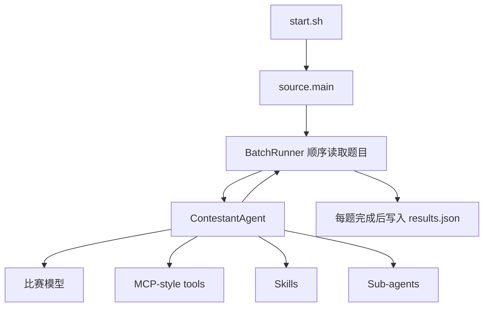

# Agent 大赛参赛与实习复盘记录

记录时间：2026 年 6 月 15 日  
项目仓库：`agent-contest-python-demo`  
主要语言：Python  
我的工作范围：Agent 架构调整、工具开发、运行时加固、测试诊断和比赛提交

## 一、参赛背景

本次比赛要求参赛程序在无人交互的环境中独立完成题目。平台通过
`start.sh` 传入题目 JSON 路径、结果 JSON 路径和 `package_id`，程序需要读取题面与附件，
调用比赛模型、工具、Skill 或子 Agent，最后把每道题的答案写入 `results.json`。

题目并不是普通问答。公开案例包含自然语言日期计算、顺序接口测试、压缩包敏感信息扫描、
Java 源码修复、多表采购审计，以及 SQLite、Wiki 和人物设定混合检索等任务。评分只读取
`answer` 字段，很多题采用精确匹配，因此多一个解释、少一个分隔符，或者引用了错误版本的资料，
都会直接丢分。

平台对单次完整运行设置了 1 小时上限。比赛方后来反馈，我们有一次 0 分提交的直接原因是总执行
时间超限。根据我保留的提交记录，官方原始 Demo 曾得到约 8 分，后续增强版本一度低于 3 分，
最后两次提交显示为 0 分。最后两次没有拿到完整判题日志，因此不能把 0 分全部归因于某一个代码
缺陷，但超时、答案精确度和环境差异都是实际存在的风险。

## 二、官方 Demo 的基线架构

官方 Demo 的设计比较简洁：



`ContestantAgent` 默认把题面、附件路径和当前发现到的能力交给模型。模型可以使用原生
tool calling；如果网关不支持，也可以退回 JSON 格式的工具协议。`BatchRunner` 顺序执行题目，
每道题结束后写一次结果。

这个基线的优点是代码短、调用链清楚、与比赛输入输出协议接近。它的问题也很直接：工具能力少，
缺少复杂任务需要的批量处理和确定性执行；运行过程不透明；缺少单题硬超时；模型一旦反复调用
工具，程序很难及时收敛。

## 三、Demo 在真实题型中暴露的问题

### 1. 题目输入和文件路径假设过强

本地测试时，题目 JSON 和附件常放在项目目录内，但比赛平台会把输入文件放在项目外部。
早期实现只允许读取题目中逐项声明的文件，目录本身和目录下的相对路径处理不完整，曾出现：

```text
File is not declared in the question
```

这类错误不会表现为模型调用失败，而是 Agent 明明看到了附件路径，却无法使用工具读取。
后来我把题目目录、题目声明的文件或目录，以及每题临时工作区统一加入文件访问边界，并保留路径
穿越检查。

### 2. 工具粒度过细，复杂题会产生大量模型往返

原始工具更适合读单个文件。采购审计题需要同时读取 4 个表格、规则文件和 20 多封审批邮件，
Agent 会逐个调用 `text_read_file`，每读一份材料都要再次唤醒模型。早期一次采购审计出现了
36 次工具调用，并在 600 秒内没有形成答案。

这类问题的瓶颈不在文件读取本身，而在“模型决定读哪个文件、读完再规划下一步”的串行循环。
同样的问题也出现在多图片、日期列表、SQLite/Wiki 双源检索和顺序接口测试中。

### 3. Prompt 太长，Few-shot 和规则之间互相干扰

中期版本曾把 Plan-Execute、日期规则、工作日规则、数据库示例、图片示例、Skill 流程、
Answer Checker 流程和多种输出格式全部写进系统提示。提示虽然看起来完整，但存在三个问题：

- 每次模型调用都要重复携带大量静态文本。
- Few-shot 容易让模型套用示例，而不是根据新题目选择工具。
- 规则过多后，模型会把“必须复查”“必须调用工具”看得比尽快给出答案更重要。

比赛是 Agent 大赛，不是思路蒸馏或人机对话任务。后续我删除了大部分 Few-shot，把提示缩减为
无人值守、按需调用工具、批量处理和严格输出格式几条核心要求。

### 4. Answer Checker 的职责一度过重

早期 Checker 不只检查格式，还会判断答案内容、再次调用模型或工具，并允许多轮修正。这样做会：

- 重复主 Agent 已经完成的分析；
- 增加 LLM 和工具调用次数；
- 在没有完整证据时改坏原答案；
- 在时间接近上限时继续消耗预算。

后来我把 Checker 限定为一次后检查，只处理空答案、Markdown、`<think>`、JSON 合法性、
分隔符和输出结构。Checker 返回空内容或失败时保留主 Agent 原答案，不再让它重新解题。

### 5. 原生工具回退范围过宽

官方 Demo 在原生工具循环发生任意异常时，都可能重新进入 JSON 工具循环。网络错误、工具内部异常
或模型超时并不表示网关不支持 tool calling，直接回退可能把整道题再执行一遍。

我把回退条件收窄为明确的 `tools`、`tool_choice` 或 function calling 不支持错误。其他异常保留
原始错误，不做整题重放。

### 6. 缺少平台级时间预算

模型接口有单次请求超时，但这不等于单题超时。模型可以在一题中连续调用几十次，每次都没有超过
120 秒，累计却可能远超比赛总时限。

真实平台日志曾出现前两题分别耗时约 38 分钟和 41 分钟的情况。另一次运行在完成第 4 题后接近
1 小时，后续题目没有机会得分。这说明仅限制单次 LLM 请求并不够，还需要限制迭代次数、工具调用
方式和单题总时长。

### 7. 本地运行成功不代表评分正确

公开案例可以验证程序是否会读取文件、调用接口和生成格式正确的答案，却不能覆盖隐藏题变化。
例如采购审计题在不同运行中曾输出多组不同的 PO 列表，说明语义判断仍受模型随机性影响。
IDE 插件题要求 `reply` 与来源原文逐字一致，即使回答含义正确，只要发生总结或改写也会失分。

这也是本次项目最重要的教训：执行成功、格式合法和答案正确是三个不同层次，不能用前两个替代
官方评分。

## 四、我完成的主要改进

### 1. 输入、输出和运行时加固

我重新梳理了比赛输入契约，使程序兼容题目 JSON 和结果路径位于项目外部的情况。运行开始时先为
全部题目预分配空答案，并在每题完成后立即写入结果，减少程序中途终止造成的答案丢失。

日志增加了题目 ID、状态、答案是否存在、答案长度、完整错误、单题耗时、累计耗时、LLM 调用数、
工具调用数、当前写入结果数，以及 `results.json` 的路径和文件大小。

### 2. Trace 和本地 Dashboard

为了定位平台只显示“0 分”但不给完整内部过程的问题，我增加了结构化 Trace 和可选 Dashboard。
Dashboard 可以查看每次 LLM 调用、工具调用、耗时和错误，同时避免自动刷新把正在阅读的页面滚回
顶部。Dashboard 默认关闭，不参与比赛提交入口，避免额外 I/O 影响正式运行。

### 3. 模型调用参数调整

我测试过流式与非流式、开启和关闭思考、不同迭代次数以及不同超时设置。最终保留了：

- 流式响应；
- 关闭模型思考；
- 单次 LLM 请求超时 120 秒；
- 主 Agent 最大 10 轮工具循环；
- 单题硬超时 600 秒；
- 工具历史输出上限 65,536 字符。

参数调整的目标不是追求模型多想，而是让每道题在有限时间内形成可评分答案。

### 4. 批量和确定性工具

我补充或增强了以下能力：

- `date_compute`：支持批量日期表达式，避免一条日期调用一次模型；
- `image_read`：支持多图一次读取，并把 Base64 图像直接交给主 Agent；
- `document_search`：检索 Markdown、Word 等规范文档；
- `archive_inspect`：安全解压 ZIP/TAR，递归列出文件并返回文本预览；
- `dataset_bundle_read`：一次读取目录内的 CSV、JSON、文本、DOCX 和 XLSX，生成统一 JSON bundle；
- `api_test_execute`：按顺序执行接口测试计划，处理 token、断言和失败继续；
- `evidence_chain_analyze`：汇总前端、后端、HAR、截图等多源故障证据；
- `code_execute`：增强 Java 类名识别、UTF-8 编译、参数传递和多用例运行。

这些工具的共同思路是：能由程序确定完成的工作，不要拆成多轮模型对话。

### 5. Skill 和子 Agent 的取舍

我尝试过 Data Reader、文档搜索 Skill、华为编程规范 Skill 和 Java 个税 Skill。实践中，Skill 并非
越多越好。过重的 Skill 会增加发现、加载和执行成本，也可能诱导模型机械套用。

最终 Java 个税能力采用“指导型 `SKILL.md` + 可参考脚本”的方式：给 Agent 代码修复思路和示例，
但不硬编码官方题目的答案。Data Reader 和文档搜索子 Agent 被轻量工具替代，主 Agent 直接负责
答案正确性。

### 6. 超时前兜底

当前版本在 600 秒单题硬超时前预留 90 秒。达到软截止后，不再接受新的模型分析或工具调用，
而是要求主模型根据已经获得的证据输出最可能的最终答案，并跳过 Checker。

我还把采购审计题的软截止临时提前到 200 秒做过实验。该题在 203.6 秒输出答案，LLM 调用从 12 次
减少到 5 次、工具调用从 11 次减少到 4 次，答案与 315 秒完整运行相同。这说明后半段耗时主要来自
重复复查。

不过，兜底机制仍有边界：同步阻塞工具不能被 `asyncio.wait_for` 立即中断。如果某个
`code_execute` 一直运行到硬超时之后，程序仍可能来不及生成兜底答案。

## 五、公开案例测试记录

一次较早的 6 题全量运行耗时约 25 分 46 秒，部分题工具调用次数很高：

| 题目 | 耗时 | LLM 调用 | 工具调用 |
|---|---:|---:|---:|
| 日期提取 `1_1` | 231 秒 | 40 | 35 |
| 接口测试 `1_4` | 104 秒 | 33 | 32 |
| 敏感信息扫描 `2_2` | 55 秒 | 12 | 9 |
| Java 个税 `2_3` | 331 秒 | 22 | 18 |
| 采购审计 `3_2` | 623 秒 | 12 | 33 |
| IDE 插件问答 `3_3` | 202 秒 | 27 | 46 |

经过 Prompt 精简、批量工具、迭代限制和运行时调整后，当前版本的同组案例结果为：

| 题目 | 状态 | 耗时 | LLM 调用 | 工具调用 |
|---|---:|---:|---:|---:|
| 日期提取 `1_1` | 成功 | 46 秒 | 4 | 3 |
| 接口测试 `1_4` | 成功 | 115 秒 | 6 | 7 |
| 敏感信息扫描 `2_2` | 成功 | 47 秒 | 6 | 9 |
| Java 个税 `2_3` | 成功 | 37 秒 | 4 | 4 |
| 采购审计 `3_2` | 成功 | 315 秒 | 12 | 11 |
| IDE 插件问答 `3_3` | 成功 | 148 秒 | 12 | 38 |

总耗时约 11 分 49 秒，6 道题都有非空答案，输出格式检查通过。两次运行所用模型版本和服务状态
不完全相同，因此这组数据不能视为严格性能基准，但足以说明重复模型往返是主要耗时来源。

项目最终保留了 90 项单元和集成测试，覆盖日期边界、Java 编译、压缩包安全、文件权限、接口鉴权、
Checker 行为、结果写入和软截止等路径。

## 六、为什么增强版本仍可能得到 0 分

这次结果让我重新认识了比赛型 Agent 的评价标准。增强能力不一定提高得分，代码越多，也意味着
更多不稳定点。

### 1. 隐藏题与公开题并不相同

公开题只能说明工具链能工作。隐藏题会改变字段、文件顺序、表达方式和材料冲突，针对公开题形成的
Prompt 或 Skill 即使没有直接硬编码，也可能产生隐性过拟合。

### 2. 总时长按整批题目计算

如果前几题长时间复查，后面的题即使有能力完成，也没有运行机会。比赛方明确反馈过总执行超时。
这类失败与单题答案质量无关，却可能导致整次提交得分极低或为 0。

### 3. 精确匹配任务容错率很低

多表审计、双源检索和服务动作映射不是“回答得大致正确”即可。字段顺序、原文引用、排序和分隔符
都可能影响得分。主 Agent 依赖自然语言理解，仍会在边界语义上产生不同判断。

### 4. 测试环境与比赛环境有差异

本地测试使用的模型服务、Java 版本、本地接口服务和文件位置与比赛环境并不完全一致。
依赖安装时间也计入总执行时间。如果运行时才创建虚拟环境并下载依赖，会直接占用答题预算。

### 5. 缺少官方逐题判分明细

最后两次提交显示 0 分，但没有拿到逐题答案、错误类型和耗时日志。没有这些证据，就无法判断是
整批超时、启动失败、隐藏题答案错误，还是多个因素共同造成。后期优化因此带有较强的不确定性。

## 七、如果重新参赛，我会怎么做

第一，我会保留官方 Demo 作为稳定基线，只做最小修改。每增加一个工具或 Agent 机制，都与基线做
A/B 提交，确认得分提升后再保留，而不是一次提交大量改动。

第二，我会先建立比赛级预算。10 道题、1 小时意味着平均每题不能超过 6 分钟，实际还要给依赖加载、
结果写入和异常重试留空间。主流程应在 3 到 4 分钟形成候选答案，剩余时间只允许一次轻量复核。

第三，我会进一步减少通用 Agent 自由度。日期、接口测试、压缩包扫描、数据库查询等结构明确的题，
优先走确定性工具；模型只负责理解题意、选择工具和整理最终格式。

第四，我会把“执行成功率”和“答案准确率”分开测试。前者看是否超时、是否写入、是否有异常；
后者需要独立的本地 Checker 或人工标注答案集。没有正确答案对照，只看程序顺利结束，很容易得到
错误的安全感。

第五，我会提前制作与比赛平台一致的离线提交包，禁止运行时下载依赖，并在干净容器中反复执行
`start.sh <question_path> <result_path> <package_id>`。

## 八、个人实习收获

这次工作让我完整经历了一个 Agent 系统从“能调用模型”到“可以无人值守运行”的过程。我实际处理了
工具协议、文件权限、外部路径、流式响应、子进程、Java 编译、结构化日志、Dashboard、批量执行、
超时控制和 Git 分支提交，不再只把 Agent 理解成一段 Prompt。

我也踩到了比较典型的工程误区：功能越堆越多，局部测试都能通过，但系统在真实约束下反而更慢、
更难判断。官方 Demo 得到过分数，而复杂版本最后出现 0 分，这个结果并不好看，但它比一次顺利的
本地演示更有价值。它迫使我把“做出功能”和“交付可评分结果”区分开。

这次参赛没有得到理想成绩。对我而言，实习记录不能只留下完成了哪些模块，也应该留下判断失误：
前期过度关注能力覆盖，后期才把总时长、精确匹配和提交环境当作第一优先级。以后再做类似任务，
我会更早建立基线、预算和可验证的评价闭环。

## 九、相关代码与提交

核心代码：

- `source/solution/contestant_agent.py`：主 Agent、工具循环、Checker 和软截止；
- `source/solution/mcp/contestant_tools.py`：本地工具实现；
- `source/runtime/batch_runner.py`：批量执行、结果写入和单题超时；
- `source/runtime/mcp_client.py`：工具权限、路径解析和运行时参数注入；
- `source/runtime/dashboard.py`：本地运行过程展示；
- `start.sh`：比赛平台启动入口。

部分关键提交：

- `56cef1f`：修复比赛输入契约和运行诊断；
- `535e4bc`：增加证据分析和接口测试工具；
- `7206515`：支持安全的批量工具调用；
- `7698938`：精简无人值守 Agent Prompt；
- `7e0608f`：限制主 Agent 最大迭代次数；
- `ff569c4`：将 Checker 改为单次后检查；
- `2ec44e1`：开启流式响应并关闭模型思考；
- `57b61cd`：加固运行时诊断和工具能力；
- `0098f54`：增加多文件 bundle 与超时兜底。

本记录只总结比赛相关工作。仓库中后续加入的 Remotion `Hello World` 视频实验不属于本次比赛方案。
